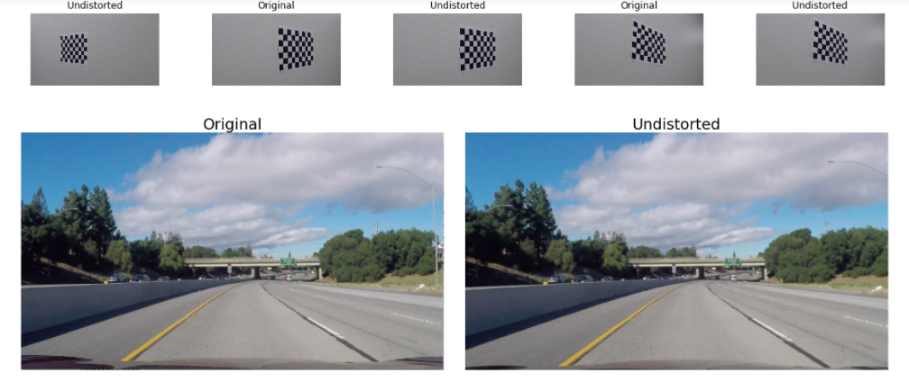

# Advanced Lane Finding Project
The goals of this project are:

* **Camera calibration.** Compute calibration matrix, distortion coefficients from a set of chessboard images.
* **Distortion correction.** Apply a distortion correction to raw images.
* **Color transforms.** Use color transforms, gradients, etc., to create a thresholded binary image.
* **Perspective transforms.** Apply a perspective transform to rectify binary image ("birds-eye view").
* **Detect pixels.** Detect lane pixels and fit to find the lane boundary.
* **Determine Curvature.** Determine the curvature of the lane and vehicle position with respect to center.
* **Warp.** Warp the detected lane boundaries back onto the original image.
* **Display.** Output display of the lane boundaries and estimation of lane curvature and vehicle position.

### The Code
**All** of the code for this project is contained in code cells in **"P2.ipynb"**. It is written as an exploratory walkthrough.

### Camera Calibration

First, I need to compute the distortion coeffecients of the camera, so I start by calibrating the camera to a chessboard, by preparing "object points", which will be the (x, y, z) coordinates of the chessboard corners in the world. Here I am assuming the chessboard is fixed on the (x, y) plane at z=0, such that the object points are the same for each calibration image.  Thus, `objp` is just a replicated array of coordinates, and `objpoints` will be appended with a copy of it every time I successfully detect all chessboard corners in a test image. Then, `imgpoints` will be appended with the (x, y) pixel position of each of the corners in the image plane with each successful chessboard detection. I then used the output `objpoints` and `imgpoints` to compute the camera calibration and distortion coefficients (**m**) using the `cv2.calibrateCamera()` function.

# The Pipeline

Having calculated the camera distortion coeffecients, the pipeline for each frame is a series of steps:

#### 1. Distortion correction

I use cv2.undistort(), using the caluclated M camera matrix. You can see the before and after here, changing areas on the outer edges of the image, on the road sign on the first image and the car on the second image:

This is done in the first code cell in the P2 notebook.

#### 2. Color & Gradient thresholds

Then I want to find the lane pixels, so I use a variety of color and gradient transforms on the image. These are done in the second and third code cells, titled Color Transform, and Detect Pixels.

I first convert the image to HLS space, and threshold the S channel, as shown here:

Then I take Sobel gradients, with kernel size 3, on x and y, and calculate direction and magnitude. 

After some experimentation on both sample road images, I find that combining the gradient magnitude and gradient direction thresholds (anded) with the saturation thresholded binary map (using the 'or' operator) produces a good tradeoff between finding the lane lines and not detecting too many other pixels. I stacked them to see the individual contributions, then combined the result:

#### 3. Perspective transform

Then I use `cv2.warpPerspective()` to warp the image into a bird's eye view.
It uses source (`src`) and destination (`dest`) points.

This is in the fourth code cell, titled 'Perspective Transforms'. 

I verified that my perspective transform was working as expected by drawing the `src` and `dest` points onto a test image and its warped counterpart to verify that the lines appear parallel in the warped image:

After some experimentation I found the co-ordinates that transform the straight road test images to parallel lines.

#### 4. Putting it together, detecting lanes

Now I have thresholded images and warped image, I put them together. Then I detect which pixels are the left lanes and which are the right, by segmenting the image at the midpoint, and assigning those on the left of the midpoint to left lane, and those on the right to the right lane.

This is in the fifth code cell, titled 'The Pipeline'. 

The final pipeline process from original image to undistorted, thresholded, perspective warped image looks like this:

#### 5. Histogram

I take a histogram of the undistorted, thresholded and warped image, to find the peaks of lane pixels. This is in the sixth code cell.

#### 6. Fit a curve

To fit curves to the lanes, I start by finding the both lane centre points, all the way up the image. For this, I use a sliding window algorithm. I move two windows up from the bottom of the image, centered on the two centre points of the histogram, which results in this:

Gathering together all the pixels and centre points for each Y position, I fit a second order polynomial to the two lane pixel collections, using `np.polyfit()`.

This is all in the seventh code cell.

Lane centers look like this:

And fitting the curves results in this:

#### 7. Calculate Curve Radius and centre offset

Then I calculate the radius of curviture of both lanes. This is in the eighth code cell. I do this by finding the circle that fits each lane, and then converting its radius from pixels into meters.

To calculate the car's distance from the centre of the lane, I first take the x position of the left lane, and the x position of the right lane, both at the bottom of image, and average them to find their centre. Then I subtract this from the midpoint of the image, to find the number of pixels that the lane centre appears offset from the midpoint of the image. I then convert this to world space meters, and show the negative of this to indicate how far off the centre of the lane the car is.

#### 8. Plot the lane

Finally, I fill in a green polygon between the two calculated lane curves, take the detected lane pixels (left in red, right in blue) image, unwarp them both back to the original image, and overlay them over the original image, as shown here:

And start to run the final pipeline over the video:

---

### Pipeline video

The final video runs the pipeline for each frame of the video, and it works reasonably well for most all frames. I smooth the curve radius using a proportional controller, to keep the number display more stable, and convert to kilometers.

Here's [the final output video](./project_video.mp4).

---

### Discussion

The final pipeline works reasonably well for the frames in the project video. It fits its lane exactly where the lane lines are, for the stretch of road that is dark and clearly defined, even with the dashed right lane. At the point in the video where the road surface changes colour, it misdetects some of the lane boundaries, but doesn't result in the lane rendering disappearing. At the second changing of colour of the road surface, it mis-tracks the right lane, and the lane detection briefly shrinks the lane. 

To improve this, storage of the previous lane fit from frame to frame would help the pipeline assume the lane hasn't drastically changed position from frame to frame.

I ran this on the two challenge videos, and it does not perform as well as the project video. Due to lighting, position, hills, and lane markings, the lanes aren't detected as reliably. Further improvement could be made to the pipeline to make it handle these situations better.

Other situations that this pipeline wouldn't be able to handle very well would be if the lanes aren't clearly marked, such as Bott's Dots, or different coloured lanes that aren't saturated differently from the road.

The pipeline also has a fixed perspective transform, so will not perform well when the camera is moved or adjusted, or there are rises and dips in the road surface, such as when going over hills. It will also not perform well when there are very sharp turns, or when the car is oriented away from the road.

This was an interesting project, and it was very enlightning to see how much processing goes into a simple feature as deteting lane lanes.
