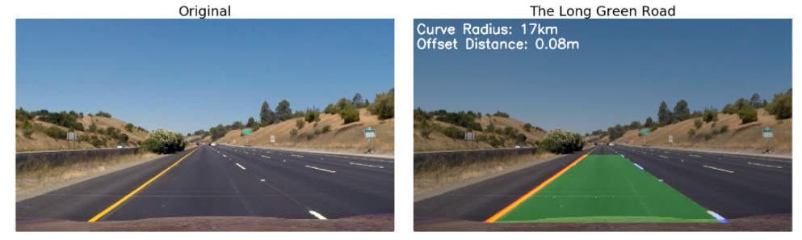

# Advanced Lane Finding Project
---
The goals of this project:

* **Camera calibration.** Compute the camera calibration matrix and distortion coefficients given a set of chessboard images.
* **Distortion correction.** Apply a distortion correction to raw images.
* **Color transforms.** Use color transforms, gradients, etc., to create a thresholded binary image.
* **Perspective transforms.** Apply a perspective transform to rectify binary image ("birds-eye view").
* **Detect pixels.** Detect lane pixels and fit to find the lane boundary.
* **Determine Curvature.** Determine the curvature of the lane and vehicle position with respect to center.
* **Warp.** Warp the detected lane boundaries back onto the original image.
* **Display.** Output visual display of the lane boundaries and numerical estimation of lane curvature and vehicle position.

---

### Camera Calibration

The code for this step is contained in the first code cell of the notebook "./P2.ipynb".

I start by preparing "object points", which will be the (x, y, z) coordinates of the chessboard corners in the world. Here I am assuming the chessboard is fixed on the (x, y) plane at z=0, such that the object points are the same for each calibration image.  Thus, `objp` is just a replicated array of coordinates, and `objpoints` will be appended with a copy of it every time I successfully detect all chessboard corners in a test image.  `imgpoints` will be appended with the (x, y) pixel position of each of the corners in the image plane with each successful chessboard detection.  

I then used the output `objpoints` and `imgpoints` to compute the camera calibration and distortion coefficients using the `cv2.calibrateCamera()` function.  I applied this distortion correction to the test image using the `cv2.undistort()` function and obtained this result: 

##Pipeline

####1. Distortion correction
I used cv2.undistort(), using the caluclated M.
You can see the before and after here:

####2. Color transform

####3. Perspective transform

The code for my perspective transform includes a function called `()`.
It source (`src`) and destination (`dest`) points. I verified that my perspective transform was working as expected by drawing the `src` and `dest` points onto a test image and its warped counterpart to verify that the lines appear parallel in the warped image.

#### Histogram

#### Identify pixels

####5. Fit a curve

I fit a second order polynomial.

####5. Calculate Curve Radius

#### Fill the road surface

---

###Pipeline video

Here's [the final output video](./project_video.mp4).

---

###Discussion

####1. Problems

Improvements...

