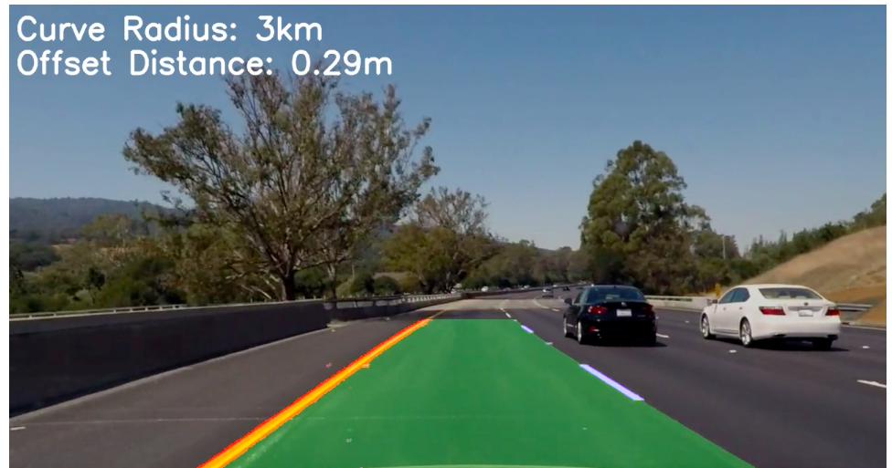

# Advanced Lane Finding Project
The goals of this project are:

* **Camera calibration.** Compute calibration matrix, distortion coefficients from a set of chessboard images.
* **Distortion correction.** Apply a distortion correction to raw images.
* **Color transforms.** Use color transforms, gradients, etc., to create a thresholded binary image.
* **Perspective transforms.** Apply a perspective transform to rectify binary image ("birds-eye view").
* **Detect pixels.** Detect lane pixels and fit to find the lane boundary.
* **Determine Curvature.** Determine the curvature of the lane and vehicle position with respect to center.
* **Warp.** Warp the detected lane boundaries back onto the original image.
* **Display.** Output display of the lane boundaries and estimation of lane curvature and vehicle position.

### The Code
**All** of the code for this project is contained in code cells in **"P2.ipynb"**. It is written as an exploratory walkthrough.

### Camera Calibration

I want to compute the distortion of the camera, so I started by calibrating the camera to a chessboard, by first preparing "object points", which will be the (x, y, z) coordinates of the chessboard corners in the world. Here I am assuming the chessboard is fixed on the (x, y) plane at z=0, such that the object points are the same for each calibration image.  Thus, `objp` is just a replicated array of coordinates, and `objpoints` will be appended with a copy of it every time I successfully detect all chessboard corners in a test image. Then, `imgpoints` will be appended with the (x, y) pixel position of each of the corners in the image plane with each successful chessboard detection. I then used the output `objpoints` and `imgpoints` to compute the camera calibration and distortion coefficients (**m**) using the `cv2.calibrateCamera()` function.

# The Pipeline

Having calculated the camera distortion values, the pipeline for each frame is a series of steps:

#### 1. Distortion correction

I used cv2.undistort(), using the caluclated M. You can see the before and after here:

#### 2. Color transform

I convert the image to HLS space and threshold the S channel.

Then I take Sobel gradients, with kernel size 3, on x and y, and calculate direction and magnitude. I stacked them to see the individual contributions, then combined the result.

#### 3. Perspective transform

I use `cv2.warpPerspective()` to warp the image into a bird's eye view.
It uses source (`src`) and destination (`dest`) points. I verified that my perspective transform was working as expected by drawing the `src` and `dest` points onto a test image and its warped counterpart to verify that the lines appear parallel in the warped image:

#### 4. Identify pixels

To find the lanes, I find which pixels in the warped image are the lanes.

The final pipeline process from original image to undistorted, thresholded, perspective warped image looks like this:

#### 5. Histogram

To start detecing lanes, I take a histogram of the undistorted, thresholded and warped image, to find the peaks of lane pixels.

Then I use a sliding window algorithm. I move two windows up from the bottom of the image, centered on the two centre high points of the histogram:

#### 6. Fit a curve

Then, I fit a second order polynomial to the two lane pixel collections.

#### 7. Calculate Curve Radius

Then I calculate the radius of curviture of both lanes.

#### 8. Fill the road surface

Then I fill in a polygon in between the two calculated lane curves and overlay it over the original undistorted image.

---

### Pipeline video

Here's [the final output video](./project_video.mp4).

---

### Discussion

It works pretty well.
